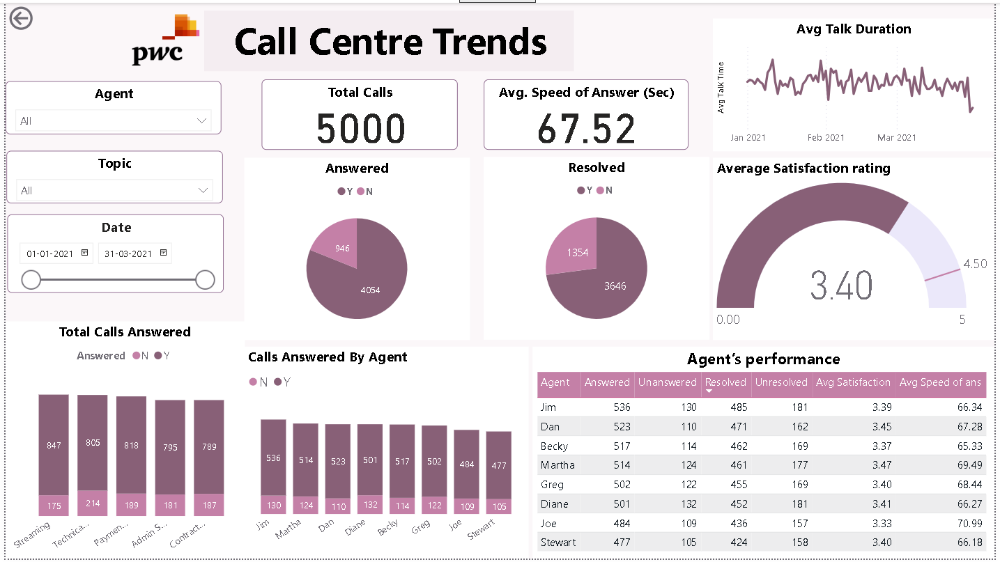
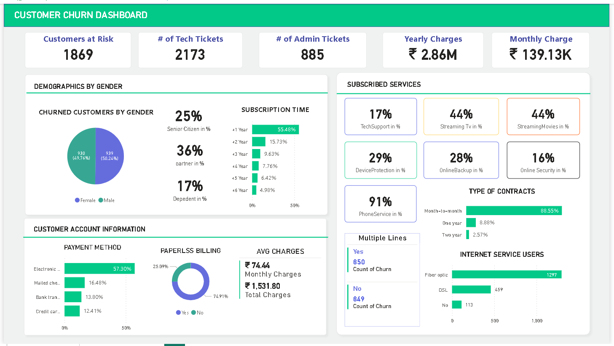
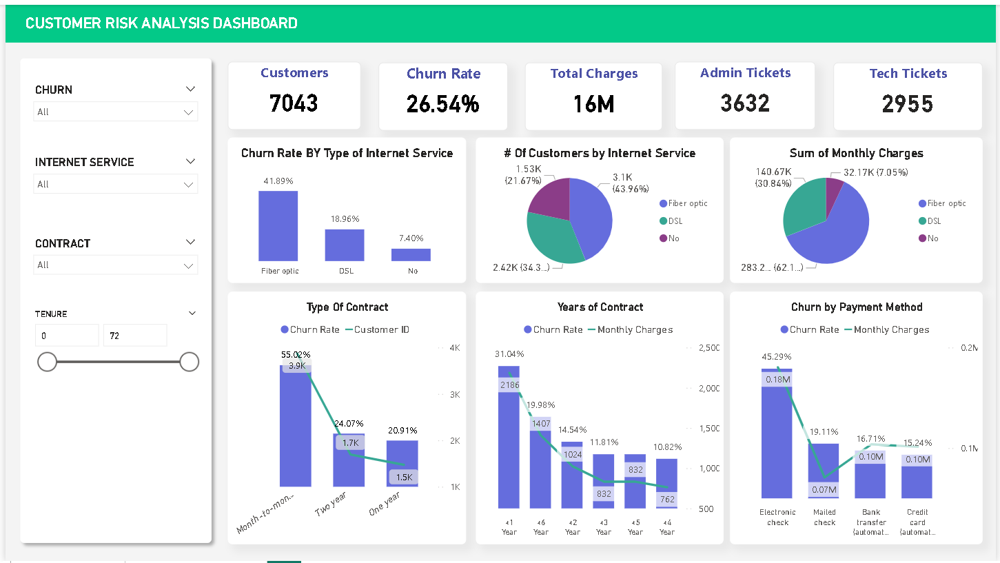
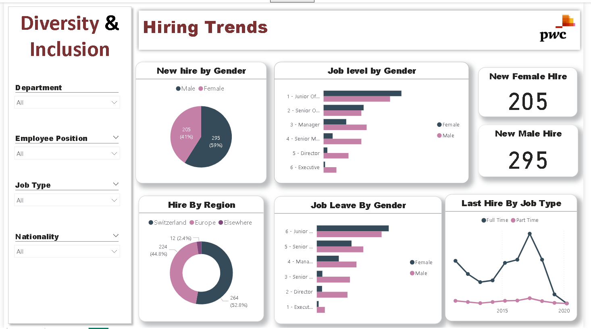
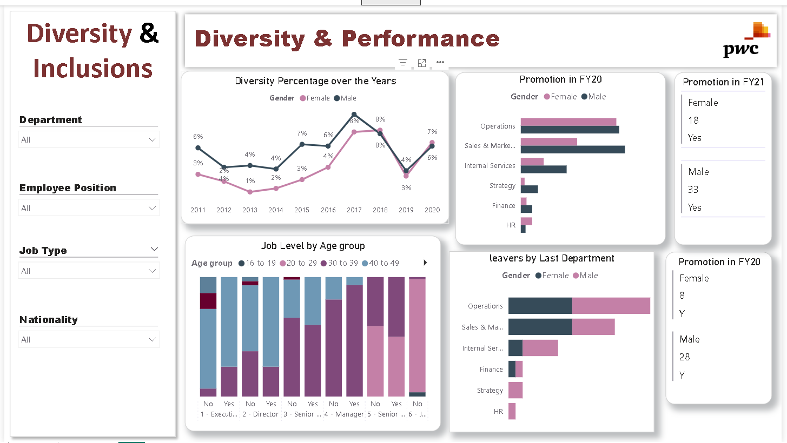

# 📊 PWC Power BI Dashboards - Call Center, Customer Churn & Diversity & Inclusion

## 📌 Overview
This repository contains three Power BI dashboards designed to analyze key business metrics for **Call Centers, Customer Churn**, and **Diversity & Inclusion**. These dashboards help businesses improve decision-making by visualizing trends, customer behavior, and workforce diversity.

---

## 🔹 1. Customer Churn Dashboard  
**Objective:** Analyze customer retention trends, identify high-risk churn segments, and optimize retention strategies.  

### 🔍 Key Features:
- **Customers at Risk:** Displays the number of customers likely to churn.  
- **Subscription Analysis:** Breakdown of churned customers by tenure and subscription type.  
- **Demographics Analysis:** Churn rate segmented by gender and age.  
- **Billing & Payment Insights:** Identifies payment methods contributing to higher churn rates.  
- **Service Usage & Contracts:** Highlights the impact of service type and contract length on churn.  

---

## 🔹 2. Customer CHurn & Risk Analysis Dashboard  
**Objective:** Predict and mitigate customer risks by analyzing churn drivers.  

### 🔍 Key Features:
- **Churn Rate by Internet Service Type:** Compares churn rates for Fiber Optic, DSL, and No Service.  
- **Contract Type Impact:** Evaluates how different contract types influence churn rates.  
- **Tenure & Monthly Charges Analysis:** Identifies churn trends based on service duration and spending patterns.  
- **Churn by Payment Method:** Highlights payment methods with higher churn tendencies.  

---

## 🔹 3. Diversity & Inclusion Dashboard  
**Objective:** Monitor and enhance workforce diversity and hiring trends.  

### 🔍 Key Features:
- **Hiring Trends by Gender:** Tracks gender representation in hiring across job levels.  
- **Region-wise Hiring:** Provides insights into workforce distribution across different locations.  
- **Job Leave & Tenure Analysis:** Examines employee retention and turnover trends.  
- **Last Hire Trends:** Displays full-time vs. part-time hiring trends over time.  

---

## 📊 Technologies Used:
- **Power BI** for data visualization  
- **DAX (Data Analysis Expressions)** for custom calculations  
- **SQL/MySQL** for data extraction and transformation  

---

## 📌 How to Use:
1. **Open the Power BI Dashboard** (.pbix file).  
2. **Interact with filters** to analyze different trends.  
3. **Use insights** to develop strategies for reducing churn, optimizing call center operations, and improving workplace diversity.  

